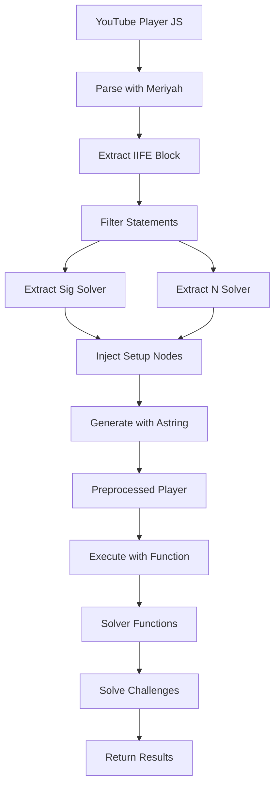

## Overview

yt-dlp-ejs is a JavaScript solver library that extracts and executes YouTube's player challenge functions. The library uses a three-stage architecture: preprocessing, solving, and bundling.

<CardGroup cols={3}>
  <Card title="Preprocessing" icon="filter">
    Parse and transform YouTube's player JavaScript using AST manipulation
  </Card>
  <Card title="Solving" icon="puzzle-piece">
    Extract and execute signature and n-parameter functions
  </Card>
  <Card title="Bundling" icon="box">
    Package solvers for multiple JavaScript runtimes
  </Card>
</CardGroup>

## Core Components

### Main Entry Point

The solver's main entry point processes requests through a unified interface:

```typescript src/yt/solver/main.ts
export default function main(input: Input): Output {
  const preprocessedPlayer =
    input.type === "player"
      ? preprocessPlayer(input.player)
      : input.preprocessed_player;
  const solvers = getFromPrepared(preprocessedPlayer);

  const responses = input.requests.map((input): Response => {
    if (!isOneOf(input.type, "n", "sig")) {
      return {
        type: "error",
        error: `Unknown request type: ${input.type}`,
      };
    }
    const solver = solvers[input.type];
    if (!solver) {
      return {
        type: "error",
        error: `Failed to extract ${input.type} function`,
      };
    }
    try {
      return {
        type: "result",
        data: Object.fromEntries(
          input.challenges.map((challenge) => [challenge, solver(challenge)]),
        ),
      };
    } catch (error) {
      return {
        type: "error",
        error:
          error instanceof Error
            ? `${error.message}\n${error.stack}`
            : `${error}`,
      };
    }
  });

  const output: Output = {
    type: "result",
    responses,
  };
  if (input.type === "player" && input.output_preprocessed) {
    output.preprocessed_player = preprocessedPlayer;
  }
  return output;
}
```

<Note>
The main function accepts either raw player JavaScript or preprocessed player code, enabling caching of the preprocessing step for improved performance.
</Note>

### Input/Output Types

The solver uses a strongly-typed interface:

```typescript
type Input =
  | {
      type: "player";
      player: string;
      requests: Request[];
      output_preprocessed: boolean;
    }
  | {
      type: "preprocessed";
      preprocessed_player: string;
      requests: Request[];
    };

type Request = {
  type: "n" | "sig";
  challenges: string[];
};

type Response =
  | {
      type: "result";
      data: Record<string, string>;
    }
  | {
      type: "error";
      error: string;
    };
```

## Preprocessing Pipeline

### AST Manipulation with Meriyah and Astring

The preprocessing stage uses **meriyah** (JavaScript parser) and **astring** (code generator) to transform YouTube's player code:

<Steps>
  <Step title="Parse Player JavaScript">
    Convert the raw player JavaScript into an Abstract Syntax Tree (AST) using meriyah

    ```typescript src/yt/solver/solvers.ts
    export function preprocessPlayer(data: string): string {
      const program = parse(data);
      const plainStatements = modifyPlayer(program);
      // ...
    }
    ```
  </Step>

  <Step title="Extract Statements">
    Navigate the AST to extract core statements from the player's IIFE wrapper

    ```typescript
    export function modifyPlayer(program: ESTree.Program) {
      const body = program.body;
      const block: ESTree.BlockStatement = (() => {
        switch (body.length) {
          case 1: {
            const func = body[0];
            if (
              func?.type === "ExpressionStatement" &&
              func.expression.type === "CallExpression" &&
              func.expression.callee.type === "MemberExpression" &&
              func.expression.callee.object.type === "FunctionExpression"
            ) {
              return func.expression.callee.object.body;
            }
            break;
          }
          case 2: {
            const func = body[1];
            if (
              func?.type === "ExpressionStatement" &&
              func.expression.type === "CallExpression" &&
              func.expression.callee.type === "FunctionExpression"
            ) {
              const block = func.expression.callee.body;
              // Skip `var window = this;`
              block.body.splice(0, 1);
              return block;
            }
            break;
          }
        }
        throw "unexpected structure";
      })();
      // Filter relevant statements
      block.body = block.body.filter((node: ESTree.Statement) => {
        if (node.type === "ExpressionStatement") {
          if (node.expression.type === "AssignmentExpression") {
            return true;
          }
          return node.expression.type === "Literal";
        }
        return true;
      });
      return block.body;
    }
    ```
  </Step>

  <Step title="Extract Solvers">
    Scan statements to identify signature and n-parameter solver functions

    ```typescript
    export function getSolutions(
      statements: ESTree.Statement[],
    ): Record<string, ESTree.ArrowFunctionExpression[]> {
      const found = {
        n: [] as ESTree.ArrowFunctionExpression[],
        sig: [] as ESTree.ArrowFunctionExpression[],
      };
      for (const statement of statements) {
        const n = extractN(statement);
        if (n) {
          found.n.push(n);
        }
        const sig = extractSig(statement);
        if (sig) {
          found.sig.push(sig);
        }
      }
      return found;
    }
    ```
  </Step>

  <Step title="Setup Environment">
    Inject runtime setup code to emulate browser globals

    ```typescript src/yt/solver/setup.ts
    export const setupNodes = parse(`
    if (typeof globalThis.XMLHttpRequest === "undefined") {
        globalThis.XMLHttpRequest = { prototype: {} };
    }
    const window = Object.create(null);
    if (typeof URL === "undefined") {
        window.location = {
            hash: "",
            host: "www.youtube.com",
            hostname: "www.youtube.com",
            href: "https://www.youtube.com/watch?v=yt-dlp-wins",
            origin: "https://www.youtube.com",
            // ... more properties
        };
    } else {
        window.location = new URL("https://www.youtube.com/watch?v=yt-dlp-wins");
    }
    if (typeof globalThis.document === "undefined") {
        globalThis.document = Object.create(null);
    }
    if (typeof globalThis.navigator === "undefined") {
        globalThis.navigator = Object.create(null);
    }
    if (typeof globalThis.self === "undefined") {
        globalThis.self = globalThis;
    }
    `).body;
    ```
  </Step>

  <Step title="Generate Executable Code">
    Convert the modified AST back to JavaScript using astring

    ```typescript
    program.body.splice(0, 0, ...setupNodes);
    return generate(program);
    ```
  </Step>
</Steps>

### Multi-Try Strategy

The preprocessor implements a resilient multi-try strategy when multiple potential solver implementations are found:

```typescript
function multiTry(
  generators: ESTree.ArrowFunctionExpression[],
): ESTree.ArrowFunctionExpression {
  return {
    type: "ArrowFunctionExpression",
    params: [
      {
        type: "Identifier",
        name: "_input",
      },
    ],
    body: {
      type: "BlockStatement",
      body: [
        // Try each generator and collect results in a Set
        // If exactly one unique result, return it
        // Otherwise, throw an error
      ],
    },
    // ...
  };
}
```

<Info>
The multi-try strategy attempts all extracted solvers and validates that they produce a single consistent result, providing robustness against YouTube player variations.
</Info>

## Data Flow



<Steps>
  <Step title="Input Processing">
    Receive player JavaScript or preprocessed code with challenge requests
  </Step>

  <Step title="Preprocessing (if needed)">
    Parse, transform, and extract solver functions from player code
  </Step>

  <Step title="Solver Extraction">
    Execute preprocessed code to obtain callable solver functions

    ```typescript
    export function getFromPrepared(code: string): {
      n: ((val: string) => string) | null;
      sig: ((val: string) => string) | null;
    } {
      const resultObj = { n: null, sig: null };
      Function("_result", code)(resultObj);
      return resultObj;
    }
    ```
  </Step>

  <Step title="Challenge Solving">
    Apply solver functions to each challenge string
  </Step>

  <Step title="Response Generation">
    Return mapped results or errors for each request
  </Step>
</Steps>

## Integration with yt-dlp

The library integrates with yt-dlp through Python bindings:

<Tabs>
  <Tab title="Python Build Hook">
    ```python hatch_build.py
    class CustomBuildHook(BuildHookInterface):
        def initialize(self, version, build_data):
            name, cmds, env = build_bundle_cmds()
            if cmds is None:
                raise RuntimeError(
                    "One of 'pnpm', 'deno', 'bun', or 'npm' could not be found. "
                    "Please install one of them to proceed with the build."
                )
            print(f"Building with {name}...")

            for cmd in cmds:
                subprocess.run(cmd, env=env, check=True)

            build_data["force_include"].update(
                {
                    "dist/yt.solver.core.min.js": "yt_dlp_ejs/yt/solver/core.min.js",
                    "dist/yt.solver.lib.min.js": "yt_dlp_ejs/yt/solver/lib.min.js",
                }
            )
    ```
  </Tab>

  <Tab title="Runtime Detection">
    ```python
    def build_bundle_cmds():
        env = os.environ.copy()

        if pnpm := shutil.which("pnpm"):
            name = "pnpm"
            install = [pnpm, "install", "--frozen-lockfile"]
            bundle = [pnpm, "run", "bundle"]

        elif deno := shutil.which("deno"):
            name = "deno"
            env["DENO_NO_UPDATE_CHECK"] = "1"
            install = [deno, "install", "--frozen"]
            bundle = [deno, "task", "bundle"]

        elif bun := shutil.which("bun"):
            name = "bun"
            install = [bun, "install", "--frozen-lockfile"]
            bundle = [bun, "--bun", "run", "bundle"]

        elif npm := shutil.which("npm"):
            name = "npm (node)"
            install = [npm, "ci"]
            bundle = [npm, "run", "bundle"]

        else:
            return None, None, None

        return name, [install, bundle], env
    ```
  </Tab>
</Tabs>

<Warning>
The build process automatically detects and uses the first available JavaScript runtime (pnpm, Deno, Bun, or npm). All runtimes must produce identical output.
</Warning>

## Bundling Architecture

The library produces multiple build outputs optimized for different use cases:

### Build Outputs

| Output | Format | Purpose | Dependencies |
|--------|--------|---------|-------------|
| `yt.solver.core.js` | IIFE | Unminified core solver | External (meriyah, astring) |
| `yt.solver.core.min.js` | IIFE | Minified core solver | External (meriyah, astring) |
| `yt.solver.lib.js` | IIFE | Unminified library bundle | Bundled |
| `yt.solver.lib.min.js` | IIFE | Minified library bundle | Bundled |
| `yt.solver.deno.lib.js` | ES Module | Deno with npm imports | npm: specifiers |
| `yt.solver.bun.lib.js` | ES Module | Bun with versioned imports | Versioned externals |

### Rollup Configuration

The build uses Rollup with specialized plugins:

```javascript rollup.config.js
export default defineConfig([
  {
    input: "src/yt/solver/main.ts",
    output: {
      name: "jsc",
      globals: {
        astring: "astring",
        input: "input",
        meriyah: "meriyah",
      },
      file: "dist/yt.solver.core.min.js",
      compact: true,
      format: "iife",
      minifyInternalExports: true,
    },
    external: ["astring", "meriyah"],
    plugins: [
      nodeResolve(),
      sucrase({
        exclude: ["node_modules/**"],
        transforms: ["typescript"],
      }),
      license({
        banner: {
          commentStyle: "ignored",
          content: LICENSE_BANNER,
        },
      }),
      terser(),
      printHash(),
    ],
  },
  // Additional configurations...
]);
```

## Dependencies

The library has minimal runtime dependencies:

<CardGroup cols={2}>
  <Card title="meriyah" icon="code" href="https://github.com/meriyah/meriyah">
    Fast, spec-compliant JavaScript parser (ISC License)
  </Card>
  <Card title="astring" icon="file-code" href="https://github.com/davidbonnet/astring">
    Tiny JavaScript code generator from ESTree AST (MIT License)
  </Card>
</CardGroup>

```json package.json
{
  "dependencies": {
    "astring": "1.9.0",
    "meriyah": "6.1.4"
  }
}
```

<Info>
The library is licensed under the Unlicense, but prebuilt wheels contain meriyah (ISC) and astring (MIT) bundled within them.
</Info>
