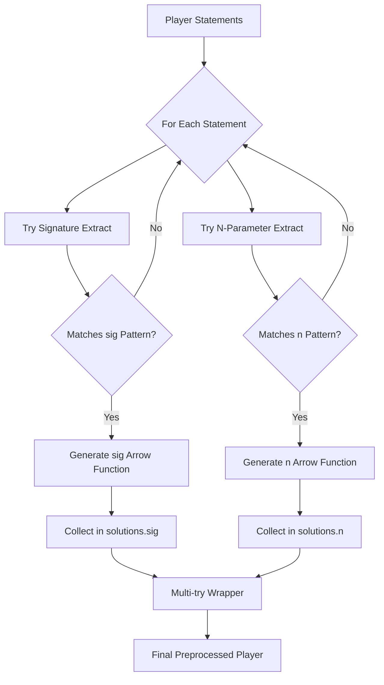

## Overview

yt-dlp-ejs implements two distinct types of solvers to handle YouTube's anti-bot protection mechanisms:

<CardGroup cols={2}>
  <Card title="Signature (sig)" icon="signature">
    Decodes scrambled video URL signatures
  </Card>
  <Card title="N-Parameter (n)" icon="n">
    Solves throttling parameter challenges
  </Card>
</CardGroup>

Both solvers are automatically extracted from YouTube's player JavaScript and executed to solve challenges dynamically.

## Signature (sig) Solving

### What is Signature Solving?

YouTube scrambles video URL signatures to prevent unauthorized access. The signature solver extracts the descrambling function from the player code and applies it to scrambled signatures.

### Why is it Needed?

Without solving the signature:
- Video URLs remain inaccessible
- Direct downloads fail with 403 errors
- Player authentication cannot be bypassed

### Implementation Details

The signature extractor searches for specific AST patterns in the player code:

```typescript src/yt/solver/sig.ts
const nsig: DeepPartial<ESTree.CallExpression> = {
  type: "CallExpression",
  callee: {
    or: [{ type: "Identifier" }, { type: "SequenceExpression" }],
  },
  arguments: [
    {},
    {
      type: "CallExpression",
      callee: {
        type: "Identifier",
        name: "decodeURIComponent",
      },
      arguments: [{}],
    },
  ],
};
```

### Extraction Strategy

The signature extractor uses multiple patterns to handle player variations:

<Tabs>
  <Tab title="Legacy Pattern">
    Matches logical expressions with sequence operations:

    ```typescript
    const logicalExpression: DeepPartial<ESTree.ExpressionStatement> = {
      type: "ExpressionStatement",
      expression: {
        type: "LogicalExpression",
        left: {
          type: "Identifier",
        },
        right: {
          type: "SequenceExpression",
          expressions: [
            {
              type: "AssignmentExpression",
              left: {
                type: "Identifier",
              },
              operator: "=",
              right: {
                type: "CallExpression",
                callee: {
                  type: "Identifier",
                },
                arguments: {
                  or: [
                    [
                      {
                        type: "CallExpression",
                        callee: {
                          type: "Identifier",
                          name: "decodeURIComponent",
                        },
                        arguments: [{ type: "Identifier" }],
                        optional: false,
                      },
                    ],
                    // More argument patterns...
                  ],
                },
                optional: false,
              },
            },
            // More expressions...
          ],
        },
        operator: "&&",
      },
    };
    ```
  </Tab>

  <Tab title="If Statement Pattern">
    Searches within conditional blocks:

    ```typescript
    } else if (stmt.type === "IfStatement") {
      // if (...) { var a, b = (0, c)(1, decodeURIComponent(...))}
      let consequent = stmt.consequent;
      while (consequent.type === "LabeledStatement") {
        consequent = consequent.body;
      }
      if (consequent.type !== "BlockStatement") {
        continue;
      }

      for (const n of consequent.body) {
        if (n.type !== "VariableDeclaration") {
          continue;
        }
        for (const decl of n.declarations) {
          if (
            matchesStructure(decl, nsigDeclarator) &&
            decl.init?.type === "CallExpression"
          ) {
            call = decl.init;
            break;
          }
        }
        if (call) {
          break;
        }
      }
    }
    ```
  </Tab>

  <Tab title="Logical Expression Pattern">
    Handles complex logical assignments:

    ```typescript
    } else if (stmt.type === "ExpressionStatement") {
      // (...) && ((...), (c = (...)(decodeURIComponent(...))))
      if (
        stmt.expression.type !== "LogicalExpression" ||
        stmt.expression.operator !== "&&" ||
        stmt.expression.right.type !== "SequenceExpression"
      ) {
        continue;
      }
      for (const expr of stmt.expression.right.expressions) {
        if (matchesStructure(expr, nsigAssignment) && expr.type) {
          if (
            expr.type === "AssignmentExpression" &&
            expr.right.type === "CallExpression"
          ) {
            call = expr.right;
            break;
          }
        }
      }
    }
    ```
  </Tab>
</Tabs>

### Solver Generation

Once a signature call is identified, the extractor generates an arrow function:

```typescript src/yt/solver/sig.ts:259-286
export function extract(
  node: ESTree.Node,
): ESTree.ArrowFunctionExpression | null {
  // ... pattern matching logic ...

  if (!call) {
    continue;
  }

  // TODO: verify identifiers here
  return {
    type: "ArrowFunctionExpression",
    params: [
      {
        type: "Identifier",
        name: "sig",
      },
    ],
    body: {
      type: "CallExpression",
      callee: call.callee,
      arguments: call.arguments.map((arg): ESTree.Expression => {
        if (
          arg.type === "CallExpression" &&
          arg.callee.type === "Identifier" &&
          arg.callee.name === "decodeURIComponent"
        ) {
          return { type: "Identifier", name: "sig" };
        }
        return arg as unknown as ESTree.Expression;
      }),
      optional: false,
    },
    async: false,
    expression: false,
    generator: false,
  };
}
```

<Note>
The extractor replaces `decodeURIComponent(...)` calls with the input parameter `sig`, creating a reusable solver function.
</Note>

### Usage Example

When a signature challenge is received:

```typescript
const input = {
  type: "player",
  player: playerJavaScript,
  requests: [
    {
      type: "sig",
      challenges: [
        "scrambled_signature_1",
        "scrambled_signature_2"
      ]
    }
  ],
  output_preprocessed: false
};

const output = main(input);
// output.responses[0].data = {
//   "scrambled_signature_1": "decoded_signature_1",
//   "scrambled_signature_2": "decoded_signature_2"
// }
```

## N-Parameter (n) Solving

### What is N-Parameter Solving?

The n-parameter is YouTube's throttling mechanism. YouTube uses it to limit playback speed for automated clients. The n-parameter solver extracts the computation function and solves challenges.

### Why is it Needed?

Without solving the n-parameter:
- Video playback is severely throttled
- Download speeds are artificially limited
- Streaming quality degrades significantly

### Implementation Details

The n-parameter extractor looks for array-based solver patterns:

```typescript src/yt/solver/n.ts
const identifier: DeepPartial<ESTree.Node> = {
  or: [
    {
      type: "VariableDeclaration",
      kind: "var",
      declarations: {
        anykey: [
          {
            type: "VariableDeclarator",
            id: {
              type: "Identifier",
            },
            init: {
              type: "ArrayExpression",
              elements: [
                {
                  type: "Identifier",
                },
              ],
            },
          },
        ],
      },
    },
    {
      type: "ExpressionStatement",
      expression: {
        type: "AssignmentExpression",
        left: {
          type: "Identifier",
        },
        operator: "=",
        right: {
          type: "ArrayExpression",
          elements: [
            {
              type: "Identifier",
            },
          ],
        },
      },
    },
  ],
} as const;
```

### Extraction Strategy

The n-parameter extractor uses two complementary approaches:

<Steps>
  <Step title="Array Pattern Matching">
    Search for variable declarations or assignments with single-element arrays:

    ```typescript src/yt/solver/n.ts:119-148
    if (node.type === "VariableDeclaration") {
      for (const declaration of node.declarations) {
        if (
          declaration.type !== "VariableDeclarator" ||
          !declaration.init ||
          declaration.init.type !== "ArrayExpression" ||
          declaration.init.elements.length !== 1
        ) {
          continue;
        }
        const [firstElement] = declaration.init.elements;
        if (firstElement && firstElement.type === "Identifier") {
          return makeSolverFuncFromName(firstElement.name);
        }
      }
    } else if (node.type === "ExpressionStatement") {
      const expr = node.expression;
      if (
        expr.type === "AssignmentExpression" &&
        expr.left.type === "Identifier" &&
        expr.operator === "=" &&
        expr.right.type === "ArrayExpression" &&
        expr.right.elements.length === 1
      ) {
        const [firstElement] = expr.right.elements;
        if (firstElement && firstElement.type === "Identifier") {
          return makeSolverFuncFromName(firstElement.name);
        }
      }
    }
    ```
  </Step>

  <Step title="Fallback Try-Catch Pattern">
    Search for functions with try-catch blocks containing specific return patterns:

    ```typescript src/yt/solver/n.ts:74-116
    const catchBlockBody = [
      {
        type: "ReturnStatement",
        argument: {
          type: "BinaryExpression",
          left: {
            type: "MemberExpression",
            object: {
              type: "Identifier",
            },
            computed: true,
            property: {
              type: "Literal",
            },
            optional: false,
          },
          right: {
            type: "Identifier",
          },
          operator: "+",
        },
      },
    ] as const;

    // Later in extraction:
    const tryNode = block.body.at(-2);
    if (
      tryNode?.type !== "TryStatement" ||
      tryNode.handler?.type !== "CatchClause"
    ) {
      return null;
    }
    const catchBody = tryNode.handler!.body.body;
    if (matchesStructure(catchBody, catchBlockBody)) {
      return makeSolverFuncFromName(name);
    }
    ```
  </Step>

  <Step title="Generate Solver Function">
    Create an arrow function wrapper around the identified solver:

    ```typescript src/yt/solver/n.ts:152-179
    function makeSolverFuncFromName(name: string): ESTree.ArrowFunctionExpression {
      return {
        type: "ArrowFunctionExpression",
        params: [
          {
            type: "Identifier",
            name: "n",
          },
        ],
        body: {
          type: "CallExpression",
          callee: {
            type: "Identifier",
            name: name,
          },
          arguments: [
            {
              type: "Identifier",
              name: "n",
            },
          ],
          optional: false,
        },
        async: false,
        expression: false,
        generator: false,
      };
    }
    ```
  </Step>
</Steps>

### Usage Example

When an n-parameter challenge is received:

```typescript
const input = {
  type: "preprocessed",
  preprocessed_player: cachedPreprocessedPlayer,
  requests: [
    {
      type: "n",
      challenges: [
        "throttle_param_1",
        "throttle_param_2"
      ]
    }
  ]
};

const output = main(input);
// output.responses[0].data = {
//   "throttle_param_1": "solved_param_1",
//   "throttle_param_2": "solved_param_2"
// }
```

## Solver Extraction Flow



## Multi-Solver Resilience

Both extractors may find multiple potential implementations in the player code. The preprocessor handles this through the multi-try strategy:

```typescript src/yt/solver/solvers.ts:87-104
export function getSolutions(
  statements: ESTree.Statement[],
): Record<string, ESTree.ArrowFunctionExpression[]> {
  const found = {
    n: [] as ESTree.ArrowFunctionExpression[],
    sig: [] as ESTree.ArrowFunctionExpression[],
  };
  for (const statement of statements) {
    const n = extractN(statement);
    if (n) {
      found.n.push(n);
    }
    const sig = extractSig(statement);
    if (sig) {
      found.sig.push(sig);
    }
  }
  return found;
}
```

<Info>
Each solver type can have multiple candidates. The multi-try wrapper executes all candidates and validates consistency.
</Info>

## Pattern Matching Utilities

Both extractors use a sophisticated pattern matching system:

```typescript
import { matchesStructure } from "../../utils.ts";
import { type DeepPartial } from "../../types.ts";
```

The `matchesStructure` function allows for:
- **Partial matching**: Only specified properties need to match
- **Alternative patterns**: `or` arrays for multiple valid structures
- **Array matching**: `anykey` for flexible array element checks

<Tabs>
  <Tab title="Simple Match">
    ```typescript
    if (matchesStructure(node, identifier)) {
      // Process matching node
    }
    ```
  </Tab>

  <Tab title="Deep Partial">
    ```typescript
    const pattern: DeepPartial<ESTree.Node> = {
      type: "FunctionExpression",
      params: {
        // Match array length without specifying exact elements
      },
      body: {
        type: "BlockStatement"
      }
    };
    ```
  </Tab>

  <Tab title="Or Patterns">
    ```typescript
    const pattern = {
      or: [
        { type: "Identifier" },
        { type: "SequenceExpression" }
      ]
    };
    ```
  </Tab>
</Tabs>

## Error Handling

Solvers gracefully handle failures:

```typescript src/yt/solver/main.ts:11-40
const responses = input.requests.map((input): Response => {
  if (!isOneOf(input.type, "n", "sig")) {
    return {
      type: "error",
      error: `Unknown request type: ${input.type}`,
    };
  }
  const solver = solvers[input.type];
  if (!solver) {
    return {
      type: "error",
      error: `Failed to extract ${input.type} function`,
    };
  }
  try {
    return {
      type: "result",
      data: Object.fromEntries(
        input.challenges.map((challenge) => [challenge, solver(challenge)]),
      ),
    };
  } catch (error) {
    return {
      type: "error",
      error:
        error instanceof Error
          ? `${error.message}\n${error.stack}`
          : `${error}`,
    };
  }
});
```

<Warning>
If a solver cannot be extracted or fails during execution, detailed error messages including stack traces are returned to aid debugging.
</Warning>

## Performance Considerations

<CardGroup cols={2}>
  <Card title="Preprocessing Cache" icon="database">
    Preprocessed player code can be cached and reused across requests, avoiding repeated AST parsing
  </Card>
  <Card title="Batch Solving" icon="layer-group">
    Multiple challenges can be solved in a single request, reducing overhead
  </Card>
</CardGroup>

```typescript
// Efficient: Preprocess once, solve many
const preprocessed = preprocessPlayer(playerJS);

const result1 = main({
  type: "preprocessed",
  preprocessed_player: preprocessed,
  requests: [{ type: "sig", challenges: batch1 }]
});

const result2 = main({
  type: "preprocessed",
  preprocessed_player: preprocessed,
  requests: [{ type: "n", challenges: batch2 }]
});
```
